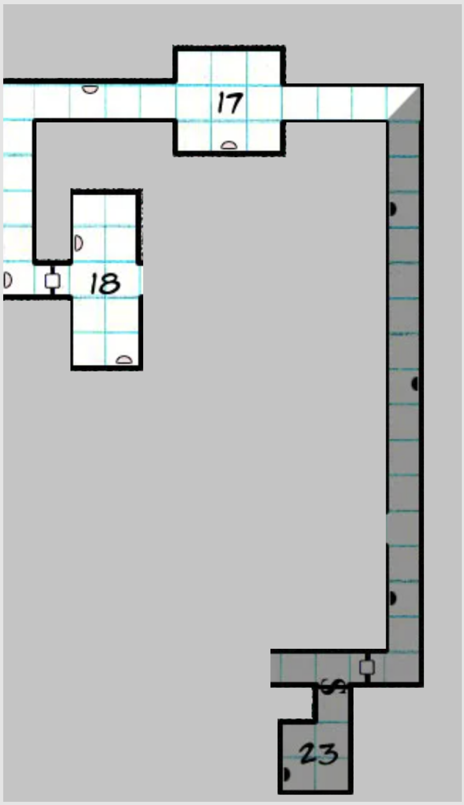

# Bosszú Penganon

Imperator (és Royo) szerint El Presidentének meg kell halnia...

Imperator megígérte Royónak, hogy Verával (kedvenc fegyvere) fejezi le El Presidentét.

Afrodité fedélzetén van egy pengáni műkincs - természetesen az Elior Klostotól szerzett magángyűjteményből.  
Ez pedig nem más, mint a legendás pengáni előadóművész, "Lui a trombitás" színaranyból készített hangszere.

Leszállás a bolygón, Imperator elsunyulja, hogy elhagyta a Pengant. Inkognitóban közlekedik.  
Banánt esznek, bemennek a legközelebbi városba, bérelnek egy utánfutót és egy dzsippet.  
Útnak indulnak a fővárosba, mikor feltűnik mögöttük a randalírozó, full beállt [El Amigo](https://github.com/Milky-Ways-Finest/milky/wiki/Helysz%C3%ADn:-Pengan#el-amigo).  
A partival van Lexi és Afrodité is - az utóbbi robottestben. Most épp [Messandei](https://i.pinimg.com/originals/e0/08/cb/e008cb5f72b20f1f4bd5a48ac2519b97.jpg)nek néz ki 🙂

## 1 nappal korábban a Penganon

Nagy buli volt este: El Presidente új kitüntetést kapott, de igazából ez csak kifogás volt a rongyrázásra, valójában egy szuperkatona expo volt illiberálisabb államok és szervezetek különféle képviselőinek.  
Doktor Schmetterling új, galateán(!) szuperkatonáit mutatták be, hogy aztán az érdeklődőkkel vásárlásokról beszélgessenek a következő napokban.  
Az est ceremónia mestere: Lui Padre (úgy néz ki mint idősebb Julio Iglesias)

- főpapi rangja van a pengani udvarban
- énekel és vezeti az estét. Mellkasánál kibuggyanó habos fehér sál díszíti flitteres énekes ruháját

Ők voltak ott:

- Hydro szövetségtől: Blurb, a kereskedelmi államtitkár tintahal és neje
    - 3 doktorátusa van
    - vízgömbben érkezett nejével
    - kísérője és testőrei: három békaember
- Arden ház vezetője: Báró Valkov Arden
    - oroszos külsőségek, sok kitüntetés, balta arc
- [Mario](https://github.com/Milky-Ways-Finest/milky/wiki/NJK:-Mario,-a-gengszter-delfin), a Karavánból. Egy gypsy harci delfin klánfőnök vizicsikóval a vállán
    - "Afterburner" márkájú dzsunka űrhajókat gyártanak űrszemétből, amiket mind arany színűre fújnak, hogy menőbbnek tűnjenek.
    - Az Afterburner a hírhedt "Tesco gazdaságos alsópolcos" űrhajó a szektorban. 1 útra jó nagyjából.
- 1 PMC vezető: [Krr'takh parancsnok](https://github.com/Milky-Ways-Finest/milky/wiki/NJK:-Krr'takh-parancsnok), a kibersáska, akivel az első kalandok során már összerúgtuk a port és fel is robbant, de úgy tűnik túlélte. Most már full robot.

## El Amigo kalandai 

[El Amigo](https://github.com/Milky-Ways-Finest/milky/wiki/Helysz%C3%ADn:-Pengan#el-amigo) közben elment vidékre. Kevés tiszta pillanatában már szabadulna innen, ezért elment a Kondor fennsíkra, ami a legmagasabban fekvő település és ahol egy radarállomás van. Betört (szó szerint) az épületbe és segélyhívást adott le az űrbe. Ezt Afrodité vette is (retcon). Kábé annyit értett belőle, mintha egy nagyon részeg ember a füledbe üvöltene valamit egy buliban.  
Ez után El Amigo visszaindult a fővárosba, a nagy stresszre, benyomott némi "gyorsítót" - ez után akadtunk össze vele.

## Az Expo

- beszállt a parti nagyja El Amigóba, be a fővárosba
- az expo elindult, jött a sok illiberális ország, birodalom sok képviselője fegyvert venni
- sikerült bejutni a palota kertjébe, ahol az expo és a buli ment. A részleteket lásd az [előző kommentben](https://github.com/Milky-Ways-Finest/milky/issues/11#issuecomment-829955852).
- Az új szuper főattrakció: kiber-galateánok, a Hiero-fiú torfok féltékenykednek rájuk
- közben a városban, a partitól külön mászkáló Afrodité (űrszexrobot testben és Lexi) észrevesz az utcán egy megkövült galateánt, akit gyorsan felszed a torf rendőrség és elfuvaroz egy elhagyatott bánya-szakadékba, ami tele ilyen halott galateánnal. Ez a lepra!
- az expón [Krr'takh parancsnokba](https://github.com/Milky-Ways-Finest/milky/wiki/NJK:-Krr'takh-parancsnok) botlanak, aki túlélte a partival való összecsapása során felrobbant űrhajóját is, most már full kibersáska lett. Összecsapnak vele és most már végleg kinyírják.
- Ulfur vesz egy kiber-galateánt, Imperátor kinyeri belőle az őt "hajtó" rubin-szilánkot, amit Royo-ból hasított ki még Schmetterling anno.
- Imperátor csomót flashback-el, a fenti műtét és fogvatartása is ekkor ugranak be
- rájön a parti, hogy azért jelent meg a lepra, mert a galateánok mágikus lények és Royo közelsége látta el őket energiával. Amíg Imperátor elment ez az energia folyton csak fogyott.
- Ulfur dumál a partin egy kaméleon-torffal, birizgálja a féltékenységét az új szuperkatonákkal szemben.
- Ulfur jelenetet rendez, hogy "selejtes" az árú (a deaktivált kiber-galateán)
- sikerült audenciát intézni El Presidentéhez. A kertből nyíló garázslejárón mennek le a föld alatti csarnokokba, amit (mint az egész kastélyt) még a humán tulajdonosa (Halusky-ház) épített anno.
- oldalára dőlt, hiányos óriási humán szobor, interziás kőfalak

## A katakombákban

A katakombákban El Presidente humán szoborgyűjteményét lehetett látni. A bolygóról gyűjtötte őket össze.

Kelin találkozott El Ninóval, aki egy nagyon torz, de élő klónja/másolata (?) lehet El Presidentének. Hatalmas méretű (4m) torz kőlény. Kiszabadította, összebarátkoztak. A lépcsőházban a pinceszinten áll most megdermedve.

A többieket felkísérték a földszintre, ahol Kommander Generális az összes emberével átkutatta őket. Kelin elrejtve tudott maradni, és utánuk nindzsázott. Két torf - egy kaméleon és egy hagyományos Hierro fiú - kísérte még őket.

Aztán elkísérték őket El Presidente szállására. El Presidente szállásán a titkos mellékajtó mögött egy kínzókamrában vizsgálják épp a "selejtes" szupergalateánt. A Hierro fiú cukkolja a kaméleon torfot hogy féltékeny-e.

Szituáció a kaland végén:  
Imperátor a bekattanás szélén, hogy támadja -e El Presidentét - compelelni kell.

## A jó doktor

Imperátor épp hogy ellenállt Royo kísértésének és még nem támadott.  
Schmetterling boncolni kezdte a szupergalateánt és mutatta, hogy hiányzik a rubinszilánk. Feszült a helyzet, Ulfur nyomta a vakítást El Presidentének.

## Kommander Generális végzete

Kelin annyira rettegett Kommander Generális mögött, hogy a mester-harcművész észreveszi, hogy hirtelen hátulról, meglepetésből lefejezte, de úgy, hogy a mester meg sem mozdult, állt tovább halott kőszoborként, kiismerhetetlen tekintettel.

Imperátor lerobbantotta Mario-álcáját, a robbanás feldöntötte Kommander Generálist, levágott feje Kelin kezében landolt, aki ettől megrémülve, üvöltve berohant a terembe - kezében a fejjel. Totál ledöbbenés, Ulfur felkapott egy kalapácsot és rávetette magát El Presidentére, aki súlyosan megsebesült, de hátában a kalapáccsal még bemenekült egy titkos járatba.

## Harc, Schmetterling halála

A két Hiero-fiú Ulfurt kezdte lőni, Kelin torf-mérget dobott a kaméleon torfra.

Imperátor Royo-ból előtörő sugárral szétrobbantotta Schmetterling testének 2/3-át, a maradékot Ulfur zúzta szét egy nagy fémszekrénnyel. A doktor utolsó tettével még aktiválta a Laokoón hadműveletet.

Az ellenállás vezetője Hectór kifelé indult, vissza a lakosztályba, hogy a forradalom élére álljon, de szitává lőtték valakik, akik befele jöttek.

Szituáció a kaland végén:

- Két torf maradt életben, a kaméleon meg van mérgezve (moderate consequence).
- Megjelent az ajtóban egy csapat kibergalateán (Laokoón hadművelet, Schmmetterling utolsó parancsa).
- Schmetterling kilapult egy szekrény alatt, amit Ulfur rúgott rá
- El Presidente elmenekült (Concede) egy titkos járatban, alig maradt életereje, egy moderate consequence maradt.
- A lakosztály ajtajában elvileg még állt egy csapat Killer Kommandós.
- El Nino lent van egy szinttel lejjebb.

## Menekülés

A bezúduló kiber-galateánok felszólítják őket, hogy adják meg magukat.  
A parti beugrik a titkosajtóba, ahol El Presidente elmenekült, sikerül bezárni. Nyillövő és zuhanócsapákat kerülgetnek sikerrel a sötét kőfolyósókon, lépcsőkön, haladnak felfelé.

A balra leágazás után újabb balkanyar következett, ahol egy bezárt ajtón behatolt a csapat. Az ajtó mögött három bárdos, szablyás bizarro galateán tartózkodott, akik egyből rátámadtak a csapat tagjaira. Kelin az ajtó fölé ugrott, hogy hátba tudja őket támadni. Imperator a folyosó kereszteződésébe állt be felfegyverkezve. Imperator fedezékbe húzódott mellette Ulfur sarlóval a kezében.

Kelin benéz a 18-as szobába, tele van fegyverekkel és egy pásttal, plusz egy ajtó, ami zárva van.  
Ulfur közben visszament a 17-es szobába fegyverért. Odaértek a kibergalateánok, felszólították megadásra. A kibergalateánok látszólag átsétáltak a 17-es termen, valószínűleg aktiválták az ottani csapdát és megsérültek.  
Ulfur betört a szobában levő titkosajtón, hatalmas, nagyon míves, görög-stílusú kézifegyvereket talált. Újabb ajtó, ami a 18-as szobába vezet, amit épp Kelin próbál kinyitni.

A három bizarro galateán közben a folyósón Imperator felé megy falanxban. Imperator lőni kezdi őket. Száll a kőpor mindenfelé - főleg a falakról.  
Kelin mögéjük kerülve egy tökéletes szúrással hátulról leszúrja a középsőt (golyófej).  
"Vasalófej" és "Üllőfej", a maradék kettő támadja Imperatort.

Ulfur érkezik hátulról gyorsvonatként egy nagy kőtörő kalapáccsal (heavy weapon) és pajjzsal - sarkában a kiber-galateánokkal. Ulfur a jobb oldali bizarrot (Vasalófej) támadja, aki hiába szólongatja a főnökét (Kelin leszúrta ugye).

## Harc és barlang foglyokkal

Ulfur elsöpri a két megmaradt bizarrót a kőtörő kalapácsával.  
Kelin acélgolyókat szór ki maga mögé a kiber-galateánok elé, mindhárman továbbrohannak.  
Kelin csapdába lép a folyósón, minden beszakad alatta, de megússza. Továbbfutnak, beomlik mögöttük a folyósó, így megszabadulnak a kiber-galateánoktól.

Egy nagy hallba érnek, ahol a Galateán birodalom stílusvilágát idéző, 1000-1500 éves domborművek vannak a plafonon. Kelin nem éri el rádión sem Nexit, sem Afroditét. Kilégzésnek átküldik a dombormű képeket - ő adta a korbecslést is. Találnak 2 liftet, lemennek a föld alá, ahonnan mély zúgó hang jön.

Egy hatalmas barlang az, közepén egy lávatóval, felette láncon egy ketrec - üresen.  
Mindenhol oldschool számítógépek, amiknek adatkábelei a lávatóhoz futnak.

Találnak egy humán birodalmi republikánus lázadó embert egy fajba vájt börtönfülkében. Úgy tűnik Pengan a Humán birodalom Guantanamója. Így megússzák a cseszegetést is és jól is járnak.

Kelin felfedez még egy börtönt, ahol Nexi, Afrodité és Arlin (a belsőépítész syle) raboskodnak. Kiszabadítják őket.

## Foglyok szabadulnak

Afrodité elmeséli hogy kapták el őket a titkos hullatemetőben és hozták ide a börtönbe Nexivel és Arlennel, majd megvizsgálja az ósdi számítógépet, amiben megtalálják Dr Pengan naplóját 1200 évvel ezelőttről.

## Royo és Pengan

A napló elején Dr Pengan (El Presidente) még tiszteletteljesen beszél benne Invictusról. Royót kutatta - akit/amit Invictustól kapott - és rájött annak hatalmára. A végére már a felemelkedés akadályát látta Invictusban és Royó segítségével akarta a vágyott hatalmat elérni.

Royótól egy furcsa személyes kisugárzást kapott, aminek hatására úgy tűnik, mintha fantasztikusan énekelne (pedig nem). Mivel Pengan alapból nárcisztikus pszichopata volt, ezért el is hitte magáról, hogy megváltó. Ezzel sikerült követőket toboroznia és szektát alapítania, akikkel elhagyták a birodalmat.

A napló olvasás közben a republikánus fogoly szólal meg a hátuk mögött: elárulta őket és titkos ajtón beengedett 12 galateánt (pár kiber változattal).

## El Presidente színre lép

Lövöldözés, sikerül 2 rács leeresztésével egy negyed cikkelybe bezárni a támadókat.  
A parti bevonul a lávató egy benyúló földnyelvén levő bunkerbe, ahol távcsöves puskákat szereznek.

A föld morajlani kezd, fröcsög a láva, El Presidente emelkedik egy kb. 2,5 métererre nőtt lávaalakként a tóból. Beindulnak a számítógépen levő hangszalagok: A "Looking for Freedom" zenéje üvölt a hangszórókból. Kelin sikít, mindenki ledöbben.

El Presidente mennydörögve üvölti:  
"Hol vagy te áruló? Elraboltad tőlem Royót! Már majdnem magamba olvasztottam évekkel ezelőtt és te elvitted!"

A füst eloszlott; Presidente visszamerült a ketrecben a lávába és feltöltődött. A földrengésektől rengeteg nagy kőtömb hullik a földre

## Harc a barlangban

Imperator gránátlövedékétől feldől a 4 kiber-galateán.  
Kelin a nagy lehullott kőtörmelékek közt közelebb ugrál az ellenhez és gránátot dob a nagy, ósdi számítógépszekrények mögé, amik a lökéshullámtól rádőlnek hat galateán katonára. Marad 2, akik elmenekülnek.

El Presidente ismét kiemelkedik a lávatóból és lávagolyókkal dobálja a visszavonuló Kelint, majdnem eltalálva, de a syle még épp beugrik a bunker mögé.

Ulfur és Imperator nagyon megsorozzák El Presidentét, Ulfur hatalmasat ver rá kalapácsával, amitől a láva páncél darabokra esik és az elnök mellkasa is megsérül.

Ekkor tűnik fel Puta Hiero a "fiaival", rengeteg torffal...

## A végső harc

El Presidente ismét leereszti magát a lávába, hogy feltöltődjön, Imperátor is beugrik, úszkál a lávában és próbálja megtalálni az elnököt.

Puta Hiero és fiai gránátokkal lövik a partit. A kaméleon torfok egy része átáll Ulfur hatására, a kiber galateánok ellen fordulnak.  
Ulfur és Imperator a kőtörő kalapáccsal és lőfegyverekkel majdnem teljesen lenullázzák El Presidentét. Végül Kelin felugrik és a kardjával kettévágja a fejét.  
Puta Hiero leállítja fiait, a kiber galateánokkal a hiero fiúk (torfok) harcolnak és kiszorítják őket a teremből. Az egész palotában harc alakul ki a két fél között.  
Puta Hiero (és fiai) már nem támadja a partit, megegyezésre hajlik. Kilégzés átveszi a palota rendszereinek irányítását.

## Az újjászületés

A láva tó feletti ketrecben megtalálják Royo másik felét: ez csinálta a gyógyító/feltámasztó varázslatot El Presidentén.  
Imperator leereszti magát a ketrecben és Royo segítségével újraépül, a fém csontváz kiég belőle és Royo is kiválik. Imperator lelkileg is megtisztul, nem érez bosszút. Újra Geoniboi lett.  
Ám Royo meg nem teljes. A kiber galateánokból kiszedik a szilánkokat, amiket az ékkő magába olvaszt, de van meg pár kiborg, akik nincsenek a palotában.

## Mario kiborgjai, DJ Storm

[Mario](https://github.com/Milky-Ways-Finest/milky/wiki/NJK:-Mario,-a-gengszter-delfin) a delfin gengszter (a Karavánból) is vett belőlük és most, hogy kitör a paláver a palotában, gyorsan lelép az űrhajójával. A parti szól Afroditének, aki felszáll és kilövi Márióék hajtóműveit az űrben. A parti bedokkol rá, harcolnak a 3 megvett kiber galateánnal. Kettőt legyőznek a harmadik nem más, mint DJ Storm, Imperator szerelme.  
Csók, összeolvadnak, Royo szilánkja elhagyja a nő testét, így a DJ meg is hal. Gyorsan viszik a testét a lávatóhoz és Royo erejével feltámasztják. A terem ez után összeomlik.

## A Pengan megváltója

Geoniboi (ex-Imperator) és a parti kiszedi Mierdából, hol vannak a tömegsírok. Geoniboi mindenkit feltámaszt Royo erejével. Ez hetekig eltart, közben nagyszámú követője lesz, szakrális vezetővé lép elő.

## Kié a hatalom?

Végül a hatalom megosztása az alábbiak szerint alakul:  
Lengua Mierda marad a kancellár, Geoniboi pedig az örökös uralkodó (távollétében is). Lengua Mierdát a nép meg akartja lincselni, de Geoniboi lecsillapítja őket. Puta Hiero továbbra is viszi a kuplerájokat. Megy a buli mindenhol "Geokk Kapitány" zenéjére.

Az ellenállók is örülnek, Geoniboi hosszan tárgyal a helyi oligarchákkal, hogy hagyják békén Mierdát, meg hogy aki teljhatalomra törne közülük, az nagyon megjárja.

## A Konzorcium

Megérkezik egy konzociumi űrhajó és bejelentkeznének nagy volumenü befektetésekkel 🙂  
A parti/penganiak egy űrhajójukat lelövik, a többieket foglyul ejtik és megverik. A Konzorcium azonnal hadat üzen, odaküldi a Bloodwater zsoldoscsapatát. Mindenki befosik a Penganon, hívják a Humán Birodalmat mediálni.

## A diplomata

Megérkezik a Humán birodalom diplomatája, [Lord Gremulon](https://github.com/Milky-Ways-Finest/milky/wiki/NJK:-Lord-Gremulon) az űrhajóján (Ulfur már találkozott vele korábban), némi fegyveres kísérettel és **Phinnel**, a humán kémnővel, akivel Ulfur beszélt az Expo alatt. A mesteri diplomatának sikerül elsimítani az ellentétet a Konzorcium és Pengan között, de nem ingyen.

A birodalom hajlandó megvédeni Pengant, cserébe a következőket kéri:

- kísérleti kutató állomás egy Grönland méretű szigeten
- pengani különleges hadsereg amit ötven éven keresztül bevethetnek
- itt fogják megcsinálni a császári harcművészeti tournamentet, ami egy újonnan épített, hatalmas, többszintes piramisban lesz!!
- továbbra is küldhetik ide a lázadozó humán republikánusokat. Geoniboi belemegy, de csak ha nincs kínzás, börtön. A foglyok egy külön pengani településen élhetnek, csak a bolygót nem hagyhatják el.

A Konzorcium az alábbiak árán eltekint a konfliktustól:

- telepíthessenek ide üdítőitalgyárat (OK, de csak azt!)
- cserébe szponzorálják a piramis építését amit a harci tournamentre csinálnak. Nagy befektetés, de nagy reklám is.

## Pengan: Szórakoztatóipar és biznisz

A császári harcművészeti tournamentre a helyi oligarchák bejelentkeznek alvállalkozónak.  
[Rox](https://github.com/Milky-Ways-Finest/milky/wiki/NJK:-Rox-\(producer\)) az owlbear producer készíti majd a showműsort. Ő az, akinek anno a műsorvezetése alatt az uniós expó alatt forgó valóságshow botrányba fulladt és szegényt kirúgták. Ez után gyorsan alkesz lett, de most próbálja összeszedni magát. Ulfur kapcsolatba lép egy humán nemessel hogy a nevében szívesen benevezne a tournamentre.

## Pengan: gazdaság

Próbálják erősíteni a turizmust, szivarok exportját most, hogy a fegyver export kiesett (?).

### Pengan: hadsereg

Kommander Generális hihetetlen halála után az általa kiképzett mestergyilkos harcművészei is sajnos meghaltak a palotaforradalomban, így profi (🙂) kiképzőtisztek nélkül maradtak a pengáni katonai erők. A legenda szerint megmérgezték őket, mert szemtől szemben nem volt esélye senkinek ellenük (persze siman legyakták őket, de utána az őket megölő kiber galateánokat is, így ez sem derült ki). A birodalom ezért küld kiképző egységeket is.

## Távozás előtt, a parti zsoldosai

A parti indulni készül most, hogy sínre tették Pengan jövőjét.  
Afrodité fedélzeten vannak (a partin kívül):

- Kilégzés
- Afrodité űrjapán szexrobot-teste
- Arlin a syle belsőépítész nő
- Nexi
- DJ Storm
- Zator a kaméleon torf tiszt

A csapat visszahívja a zsoldosaikat: Művésznő, Ronin, Overkill.  
Mind a nafta szállítmányok nyomát követik, amik ugye titkos stash aszteroida helyeken voltak elrejtve, de Kelin felfedte a koordinátákat és ezért az alvilág kifosztotta és mindent elvittek. Ezt próbálják most lekövetni. Mindenki bejelentkezik, kivéve Ronint.

## Sáskacsapda

Az **Neutrínóörvény**, röviden csak **Örvény** nevű kalózhajó legénysége hívja hőseinket: elkapták Ronint, a parti libertárius sáskalény zsoldosát (jól meg is tépázták). Az Örvény kapitánya egy badass medúza aki egy recsegő hangszóróval beszél miközben elektromosan világít. A neve **Űrbél**. Az egyik embere egy tintahal, akinek a neve Vasseur Xellos a **Csápos**.

Megy a fenyegetőzés, végül váltságdíjként még egy nagy adag [naftát](https://github.com/Milky-Ways-Finest/milky/wiki/Item:-Nafta) ígér be a parti a kalózoknak.

Út közben fel lehet venni Overkillt és a Művésznőt. Fel kell venni Bifffet is hogy csináljon Pöceolajat és azt adják el a kalózoknak - Roninért cserébe.

## El Amigo rehabilitálása

[El Amigót](https://github.com/Milky-Ways-Finest/milky/wiki/Helysz%C3%ADn:-Pengan#el-amigo) kiszerelik a monster truck koncertbusz testből és Afrodité hajótestéhez rögzítik. Az üzemanyagot kiszivattyúzák belőle, hogy nehogy a hipertérben indítsa be magát kelekótyaságában. Afrodité szerint el kell vinni a faj egy öreg bölcséhez, aki talán tud segíteni a mára mentális ronccsá vált hajtóművön. Ismer ilyet, de nem tudja, hogy most hol lehet.

A parti könnyes búcsú keretében - és egy utolsó nagy buli után - elhagyja a Pengánt. Afrodité belép a hipertérbe.

## Régi ismerős

Egyszer csak [Geid Baul](https://github.com/Milky-Ways-Finest/milky/wiki/NJK:-Geid-Baul) (nővé operálva) jelenik meg az űrhajó kijelzőin. Gúnyosan beszámol róla, hogy hamisított naftát terjesztett, amire nyomkövetőt tett, hogy a parti zsoldosai ráakadjanak és csapdába sétáljanak. Így kaptak el Ronint is az **Örvény** kalózai.

“Örökre az űr sötétjében fogtok sodródni, hahahaha!” - kacagja Geid Baul, majd minden rendszer és fény lekapcsol a hajón....

**Kaland vége.** Ki tudja mi lesz ezután...!

## Nyitott témák következő kalandokra

- felvenni Overkillt és a Művésznőt
- Ronint kiszabadítani
- felvenni Bifffet, hogy csináljon pöceolajat nafta helyett (váltságdíj Roninért)
- magán térkapu, biznisz [Astaalával](https://github.com/Milky-Ways-Finest/milky/wiki/NJK:-Astaala-az-%C5%B1rcsiga), az űrcsigával
- kristályok összeszedése (9db, amiből 2 megvan)
- El Amigót elvinni a rejtőző, bölcs élő hajtóműhöz, hogy a parti helyrehozza szegényt

